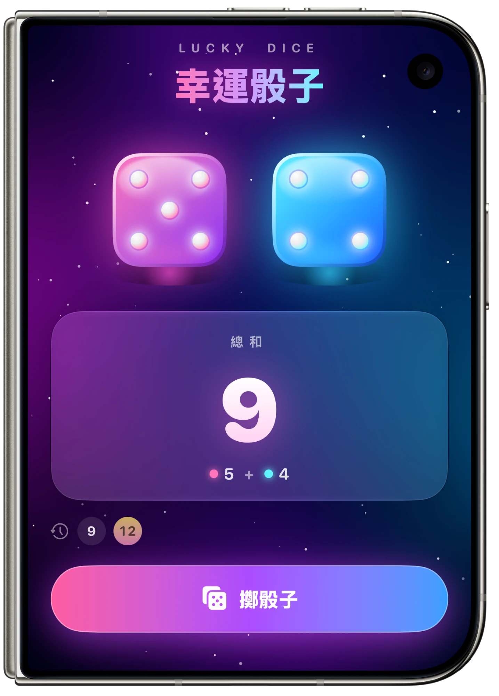

<a id="top"></a>

<div align="center">

# 🎲 Lucky Dice · 幸運骰子

**A dazzling two-dice roller for iOS, built with SwiftUI**<br>
**用 SwiftUI 打造、令人眼睛一亮的雙骰子 App**

[](https://developer.apple.com/ios/)
[](https://swift.org)
[](https://developer.apple.com/xcode/swiftui/)
[](https://developer.apple.com/xcode/)
[](https://developer.apple.com/design/)
[](#)

[🇺🇸 English](#english) · [🇹🇼 繁體中文](#chinese)



</div>

---

<a id="english"></a>

## 🇺🇸 English

> 🔀 [切換到繁體中文](#chinese)

### ✨ Features

| | Feature | Description |
|---|---|---|
| 🎲 | **Two dice** | A rose-pink and an aqua-blue die, styled like glossy candy gems with highlights and neon glow |
| 👆 | **Tap to roll** | Press the **Roll** button — or tap the dice directly — to roll |
| ➕ | **Live total** | A big rolling number on a Liquid Glass panel, with the `5 + 4` breakdown below |
| 🤸 | **Physical roll animation** | Dice jump, tumble in 3D, squash on landing and bounce three times; floor shadows shrink with height |
| 🔮 | **Morphing pips** | Pips pop in and out smoothly instead of the face swapping abruptly |
| 🏅 | **Special badges** | Doubles 🎉, double sixes ✨, snake eyes 🐍, lucky seven 🍀 |
| 🎊 | **Confetti** | Rolling doubles bursts confetti from the center of the screen |
| 🕘 | **Roll history** | The last 7 totals, with doubles highlighted in gold |
| 📳 | **Haptics** | Light ticks while the dice are airborne, a heavy thump on landing, success feedback on doubles |
| 🌌 | **Cosmic backdrop** | An animated mesh-gradient aurora with a twinkling starfield |

### 🛠 Tech Highlights

- `KeyframeAnimator` drives the jump / spin / squash-and-stretch roll
- `MeshGradient` + `TimelineView` for the flowing aurora background
- `Canvas` renders the starfield and the confetti particle system
- `.glassEffect()` (Liquid Glass) for the total panel
- `.contentTransition(.numericText())` for the rolling total
- `.sensoryFeedback` for haptics, `.symbolEffect(.bounce)` on the button icon

### 📁 Project Structure

```
DiceApp/
├── MyApp.swift            # App entry point
├── ContentView.swift      # Main screen & roll logic
├── DieView.swift          # Die face, pips & roll animation
├── CosmicBackground.swift # Aurora mesh gradient + starfield
└── Effects.swift          # Confetti, shimmer & roll button style
```

### 🚀 Getting Started

1. Requires **Xcode 27** and **iOS 27** or later
2. Clone the repo and open `DiceApp.xcodeproj`
3. Select an iPhone simulator or device and press **⌘R**

---

<a id="chinese"></a>

## 🇹🇼 繁體中文

> 🔀 [Switch to English](#english)

### ✨ 功能特色

| | 功能 | 說明 |
|---|---|---|
| 🎲 | **兩顆骰子** | 粉紫與青藍兩顆糖果寶石風骰子，有高光、光澤與霓虹光暈 |
| 👆 | **點擊擲骰** | 按下「擲骰子」按鈕，或直接點骰子，就能擲出新點數 |
| ➕ | **即時總和** | 毛玻璃（Liquid Glass）面板上的大數字會跟著滾動，下方顯示 `5 + 4` 算式 |
| 🤸 | **擬真擲骰動畫** | 骰子會跳起、3D 翻轉、落地壓扁再彈跳三次，地面陰影隨高度縮放 |
| 🔮 | **點數變形** | 換點數時骰子上的點會彈出或縮回，不是生硬地直接換面 |
| 🏅 | **特殊徽章** | 豹子 🎉、雙六滿點 ✨、蛇眼 🐍、幸運七 🍀 |
| 🎊 | **彩帶慶祝** | 擲出豹子時，彩帶從畫面中央噴發 |
| 🕘 | **擲骰紀錄** | 保留最近 7 次總和，豹子以金色標示 |
| 📳 | **震動回饋** | 骰子在空中時輕震、落地重震，擲出豹子有成功震動 |
| 🌌 | **宇宙背景** | 緩慢流動的極光網格漸層，加上閃爍星空 |

### 🛠 技術亮點

- 以 `KeyframeAnimator` 製作跳躍、翻轉、壓扁回彈的擲骰動畫
- 以 `MeshGradient` + `TimelineView` 製作流動極光背景
- 以 `Canvas` 繪製星空與彩帶粒子系統
- 以 `.glassEffect()`（Liquid Glass）製作總和面板
- 以 `.contentTransition(.numericText())` 讓總和數字滾動
- 以 `.sensoryFeedback` 提供震動回饋，按鈕圖示使用 `.symbolEffect(.bounce)`

### 📁 專案結構

```
DiceApp/
├── MyApp.swift            # App 進入點
├── ContentView.swift      # 主畫面與擲骰邏輯
├── DieView.swift          # 骰子外觀、點數與擲骰動畫
├── CosmicBackground.swift # 極光漸層 + 星空背景
└── Effects.swift          # 彩帶、掃光與按鈕樣式
```

### 🚀 開始使用

1. 需要 **Xcode 27** 與 **iOS 27** 以上版本
2. Clone 專案後開啟 `DiceApp.xcodeproj`
3. 選擇 iPhone 模擬器或實機，按下 **⌘R** 執行

---

<div align="center">

Made with ❤️ and SwiftUI · [⬆️ Back to top](#top)

</div>
